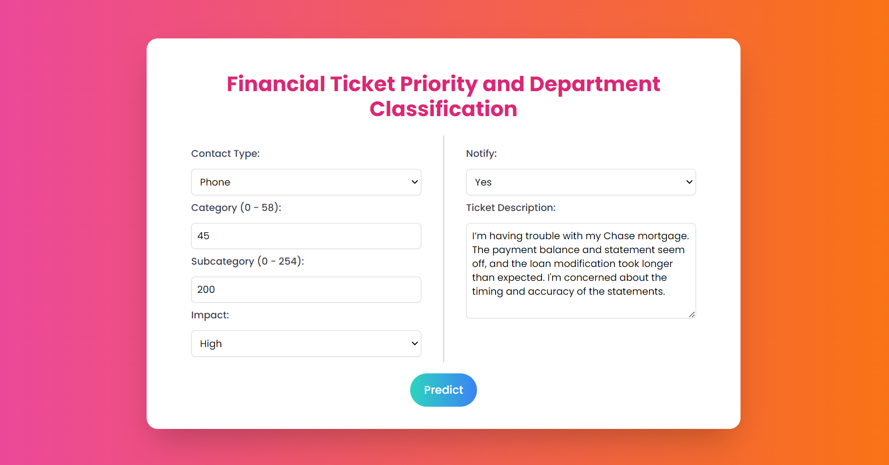
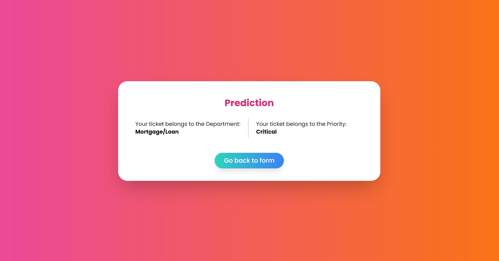

---

# Finance Incident Classification Web App

This project is a **web application** that uses machine learning models to predict the **Department** and **Priority** for finance-related incidents based on their descriptions. The app is built with **Flask** for the backend, **Tailwind CSS** for the frontend, and includes several machine learning models for incident classification. The application is containerized using **Docker** and deployed for remote access via **Railway**.




## Features

- Predicts the department responsible for handling an incident.
- Classifies the priority of incidents.
- User-friendly web interface built with **Tailwind CSS**.
- Flask-based backend for seamless model integration.
- Containerized application using Docker for easy deployment.

## Technologies Used

- **Flask** for building the web application.
- **Tailwind CSS** for the frontend design.
- **Machine Learning Models** stored as PKL files:
  - Vectorizer
  - Count Model
  - Priority Classification Model
  - Department Classification Model
- **Docker** for containerizing the application.
- **Railway** for deploying the app.

## Prerequisites

- Python 3.x
- Docker
- Docker Hub account
- Railway account (for deployment)

## Setup

### Clone the repository
```bash
git clone <repository-url>
cd <repository-directory>
```

### Install dependencies
Make sure to create a virtual environment and install the required dependencies.
```bash
pip install -r requirements.txt
```

### Flask Application
To run the Flask app locally:
```bash
flask run
```

The web app will be available at: `http://127.0.0.1:5000/`

## Docker Setup

### 1. Build Docker Image

To build the Docker image for the web app, use the following command:
```bash
docker build -t flask-app .
```

### 2. Save Docker Image to a File

To save the Docker image as a `.tar` file, use the command:
```bash
docker save -o flask-app.tar flask-app
```

### 3. Run Docker Image

To run the Docker image, use:
```bash
docker run -p 5000:5000 flask-app
```

This will run the app in a container, and it will be accessible at `http://localhost:5000/`.

## Deployment via Railway

After pushing the Docker image to **Docker Hub**, you can deploy it to **Railway** or any other cloud service to make it accessible from anywhere.

## Commands Summary

- **Build Docker image**:  
  `docker build -t flask-app .`
  
- **Save Docker image**:  
  `docker save -o flask-app.tar flask-app`
  
- **Run Docker container**:  
  `docker run -p 5000:5000 flask-app`

## License

This project is licensed under the MIT License.

---

This **README** provides setup instructions, usage, and deployment steps for your project. You can add the actual repository URL where needed.
